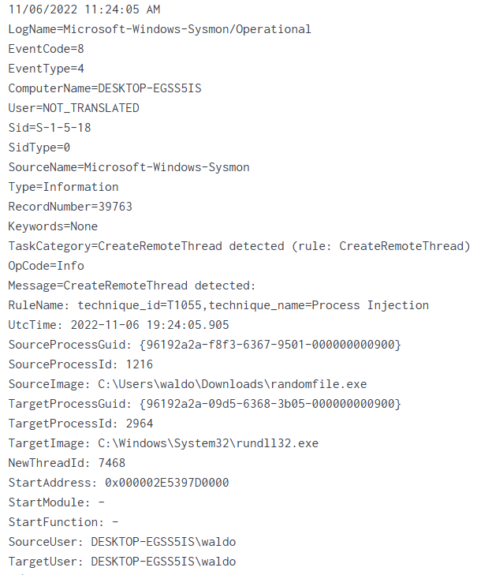
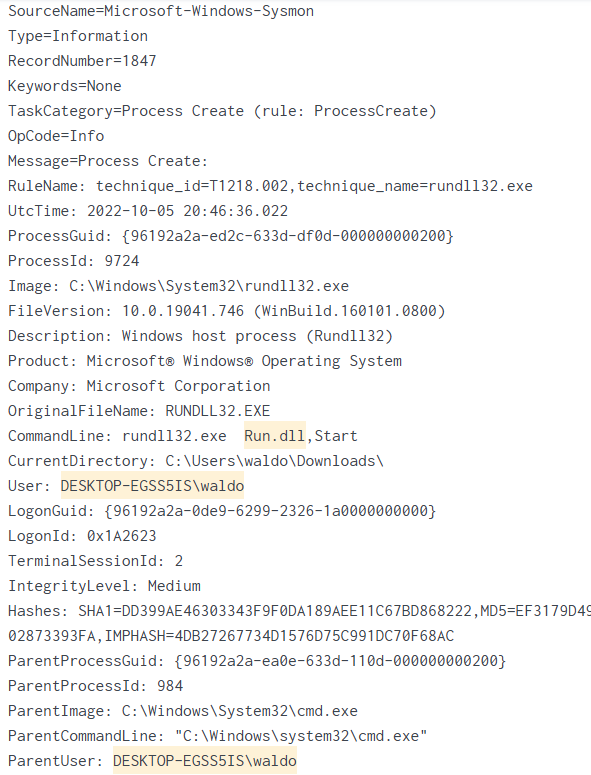

# Scenario
This skills assessment section builds upon the progress made in the Intrusion Detection With Splunk (Real-world Scenario) section. Our objective is to identify any missing components of the attack chain and trace the malicious process responsible for initiating the infection.

## Task 1:
Navigate to http://[Target IP]:8000, open the "Search & Reporting" application, and find through SPL searches against all data the process that created remote threads in rundll32.exe.
* SPL
```
index=* sourcetype=WinEventLog:Sysmon TargetImage="*rundll32.exe*" EventCode=8 
| stats count by SourceImage
```

* Answer
```text
randomfile.exe
```

## Task 2:
Navigate to http://[Target IP]:8000, open the "Search & Reporting" application, and find through SPL searches against all data the process that started the infection.
* SPL
```
index=main sourcetype="WinEventLog:Sysmon" "*DESKTOP-EGSS5IS\\waldo*" "*Run.dll*"
| stats count by Image
```

* Answer
```text
rundll32.exe
```
